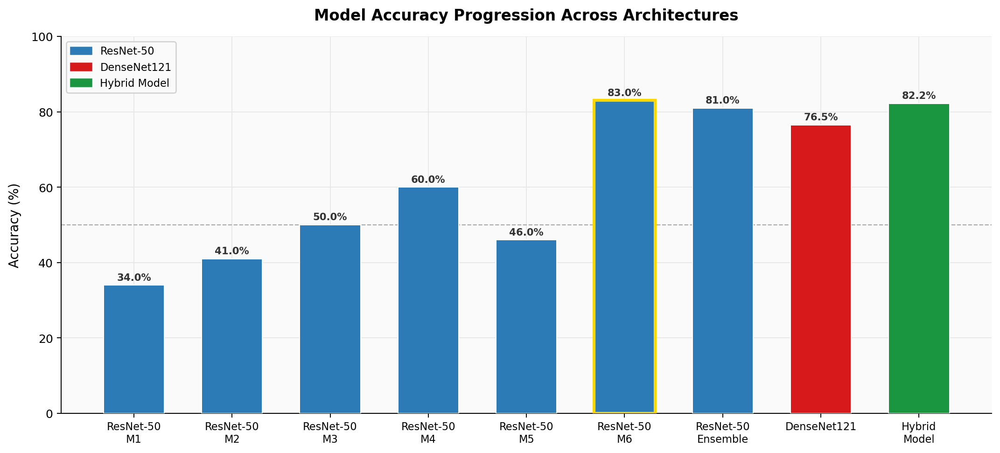
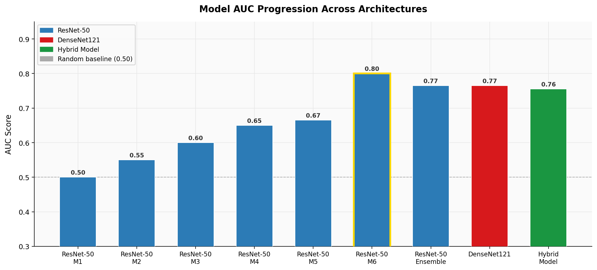
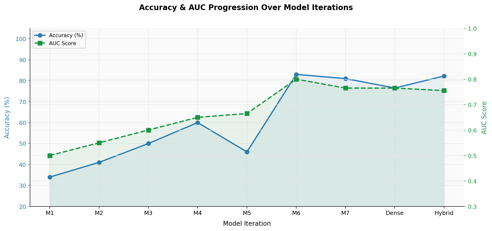

# Malnutrition Detection from Facial Images

A deep learning pipeline for detecting malnutrition in children from facial images, using transfer learning and a comparison of three modeling approaches. The best model (a fine-tuned ResNet-50) reaches **83% accuracy** and **0.80 AUC**.

Faculty-supervised project under Prof. Rajya Lakshmi, BITS Pilani.

## Overview

Traditional malnutrition screening relies on anthropometric measurements (height, weight, BMI) and clinical evaluation, which can be slow and resource-intensive in low-resource settings. This project explores whether facial images alone can serve as a non-invasive, scalable signal for malnutrition detection.

**Full write-up:** see [`report/project_report.pdf`](report/project_report.pdf) for the complete methodology, results, and analysis.

## Dataset

~446 facial images across two classes (Normal / Abnormal), with class imbalance. Given the small dataset size, models used transfer learning rather than training from scratch, with an auxiliary facial-aging dataset (FG-NET) used to pretrain some models before fine-tuning on the malnutrition task. **The dataset itself is not included in this repository**, since it contains real children's facial images.

## Approach

Three modeling approaches were implemented and compared:

| Approach | Description | Notebook |
|---|---|---|
| **ResNet-50** | Two-stage transfer learning: pretrained on FG-NET for facial-age features, then fine-tuned on malnutrition classification | [`notebooks/ResNet-50.ipynb`](notebooks/ResNet-50.ipynb) |
| **DenseNet121** | Same two-stage strategy, using DenseNet121 as the backbone | [`notebooks/DenseNet-121.ipynb`](notebooks/DenseNet-121.ipynb) |
| **Hybrid model** | Deep features from pretrained CNNs, classified with Random Forest / SVM instead of end-to-end training | [`notebooks/Hybrid_advanced.ipynb`](notebooks/Hybrid_advanced.ipynb) |

DenseNet121 and the hybrid model were built as comparison points to confirm the ResNet-50 result was robust, not a fluke of one architecture.

## Results

| Model | Accuracy | AUC |
|---|---|---|
| ResNet-50 (final) | **83%** | **0.80** |
| DenseNet121 | 76–77% | 0.76–0.77 |
| Hybrid (CNN features + classifier) | 82.2% | 0.75–0.76 |

Accuracy alone is misleading on an imbalanced dataset, so AUC and confusion matrices were used throughout to evaluate class-level performance rather than overall accuracy.

The chart below combines both metrics across all 9 model iterations, showing the same trend in one view — the sharp jump at the ResNet-50 preprocessing fix, followed by comparable performance from DenseNet121 and the hybrid model.

### Key finding

The largest single improvement came from correcting image preprocessing to match what the pretrained ResNet-50 network expected, not from a change in architecture. This one fix took accuracy from ~60% to ~83%. Earlier iterations (documented in the full report) show the progression from a near-random 34% baseline up to this result.

### ResNet-50 vs. DenseNet121

Both architectures address vanishing gradients in deep networks, but connect layers differently: ResNet-50 uses additive skip connections (each block adds its input back to its output), while DenseNet121 concatenates the outputs of all preceding layers as input to each new layer. In this project, ResNet-50 outperformed DenseNet121, plausibly because DenseNet's heavier feature reuse is more prone to overfitting on a small dataset (~446 images) — a pattern noted in the full report.

## Tech stack

Python, TensorFlow, Keras, scikit-learn, Google Colab

## Notes

- `notebooks/` contains the final, best-performing version of each approach.
- This repository contains code only. The dataset is not redistributed here, in line with the sensitivity of the data (facial images of children).
